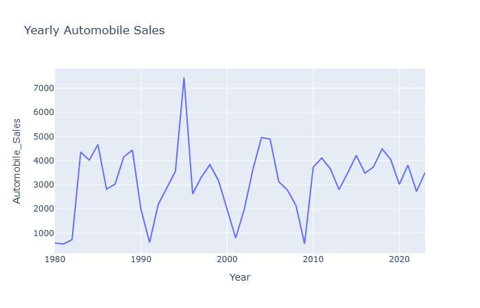
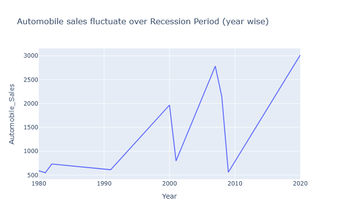
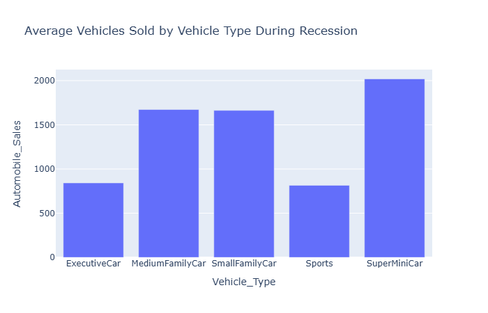
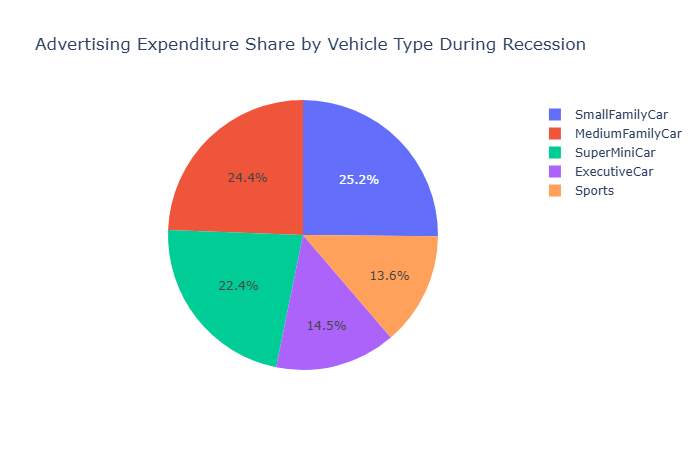
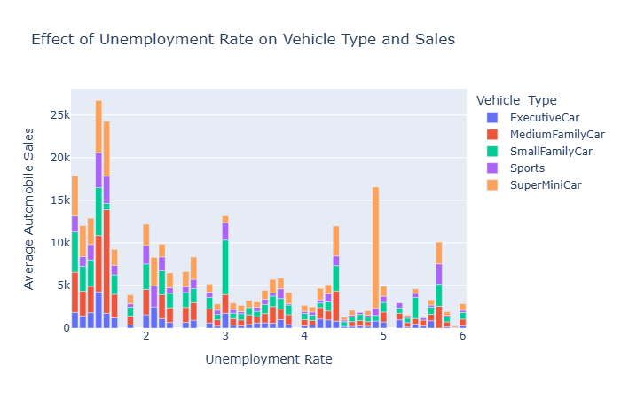

# Analysis of Automobile Sales During Recessionary Periods

## Project Overview
This project involves a comprehensive **Exploratory Data Analysis (EDA)** and visualization of historical automobile sales data. By analyzing sales fluctuations alongside key economic indicators—such as GDP, unemployment rates, and consumer confidence—the project identifies critical patterns in consumer behavior and market resilience during financial downturns. The goal is to provide data-driven insights that help stakeholders optimize marketing and inventory strategies during volatile economic cycles.

---

## Dataset Overview
The analysis is performed on a synthetic dataset designed to simulate real-world economic scenarios. It includes:
*   **Time Series Data**: Daily, monthly, and yearly sales records.
*   **Economic Variables**: GDP, Unemployment Rate, and Consumer Confidence Index.
*   **Sales Attributes**: Vehicle types (SuperMiniCar, SmallFamilyCar, MediumFamilyCar, ExecutiveCar, Sports), average price, and sales volume.
*   **Marketing Data**: Advertising expenditure and seasonality weights.

---

## Data Cleaning & Preparation
Before visualization, the data underwent a rigorous cleaning process to ensure accuracy:
*   **Missing Value Treatment**: Identified and handled null entries to prevent bias in statistical trends.
*   **De-duplication**: Removed duplicate records to maintain data integrity.
*   **Normalization**: Standardized numerical values to allow for direct comparison between different economic metrics.
*   **Date Engineering**: Converted raw date formats into usable 'Month' and 'Year' features for time-series analysis.

---

## Exploratory Data Analysis (EDA)

### 1. Yearly Sales Trends

*   **Description**: A line chart showing total automobile sales from 1980 to 2023.
*   **Commentary**: This visualization highlights distinct "dips" in sales that align with known recession periods. 
*   **Trend**: While the overall market grows over time, recession years cause sharp, immediate contractions in sales volume.

### 2. Recession Period Sales Fluctuations

*   **Description**: A focused line chart analyzing sales behavior specifically during years marked as "Recession".
*   **Commentary**: This graph demonstrates that even within a recession, sales are not stagnant but fluctuate based on short-term economic shifts.
*   **Insight**: Identifying these internal fluctuations helps businesses time their recovery efforts.

### 3. Sales by Vehicle Type (Recession vs. Normal)

*   **Description**: A bar chart comparing the average sales of different vehicle categories during recessions.
*   **Commentary**: The "SuperMiniCar" category shows the highest resilience, while "Executive" and "Sports" cars see the largest decline.
*   **Pattern**: Consumers prioritize affordability and utility over luxury when financial security is low.

### 4. Advertising Expenditure Share

*   **Description**: A pie chart illustrating how companies distribute their advertising budget across vehicle types during downturns.
*   **Commentary**: Budget is heavily skewed toward "Small" and "Medium" family cars (combined ~49.6%).
*   **Insight**: Marketing efforts shift toward "safe" bets—practical vehicles that maintain a steady demand even in a poor economy.

### 5. Unemployment Impact on Sales

*   **Description**: A stacked bar chart showing the relationship between unemployment rates and sales volume for various vehicle types.
*   **Commentary**: There is a clear inverse relationship: as the unemployment rate increases, total sales volume across all categories decreases.
*   **Insight**: This confirms that labor market health is one of the most significant external predictors of automotive industry performance.

---

## Key Insights
*   **Affordability Wins**: During recessions, sales of low-cost, fuel-efficient vehicles like SuperMiniCars remain significantly higher than luxury or sports models.
*   **GDP Correlation**: Automobile sales serve as a strong proxy for GDP; when the national economic output drops, vehicle purchases follow almost immediately.
*   **Strategic Marketing**: Data shows that firms that maintain advertising for practical family vehicles during recessions capture a larger share of the remaining market.
*   **Seasonality Resilience**: Seasonal peaks (like year-end sales) still occur during recessions but at a lower total volume compared to non-recession years.

---

## Tools and Libraries
*   **Programming**: Python
*   **Data Manipulation**: Pandas, NumPy
*   **Visualization**: Matplotlib, Seaborn, Plotly
*   **Dashboarding**: Dash

---

## How to Run the Project
1.  **Clone the Repo**: `git clone [repository-url]`
2.  **Install Libraries**: `pip install pandas numpy matplotlib seaborn plotly dash`
3.  **Run Analysis**: Open and run the Jupyter Notebook files to generate the EDA reports.
4.  **View Dashboard**: Run `python Dashboard-with-Ploty-and-Dash.py` to launch the interactive dashboard in your browser.

---

## Conclusion
This project demonstrates that while economic recessions are challenging for the automotive industry, the impact is not uniform across all segments. Through data analysis, we learned that focusing on entry-level models and aligning marketing budgets with consumer utility is the most effective way to weather financial instability. Moving forward, these models can be used to forecast future sales trends based on emerging economic indicators.
